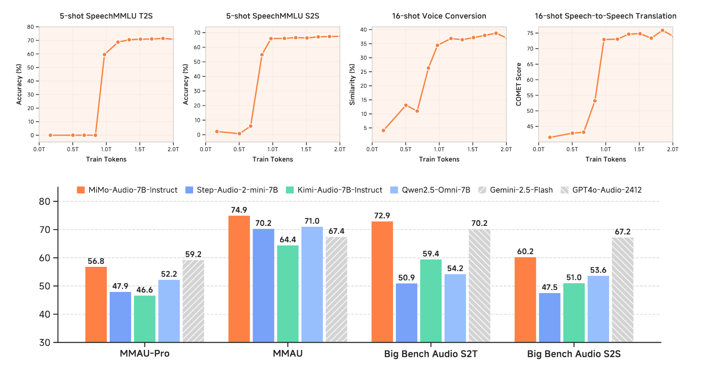
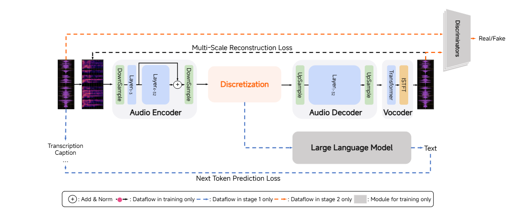
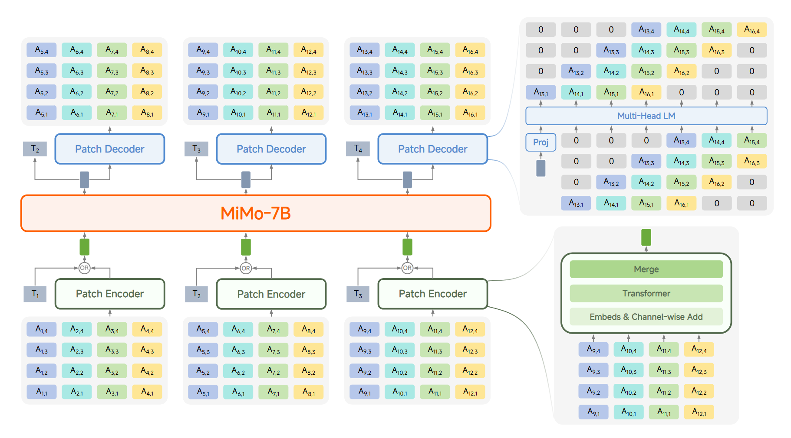
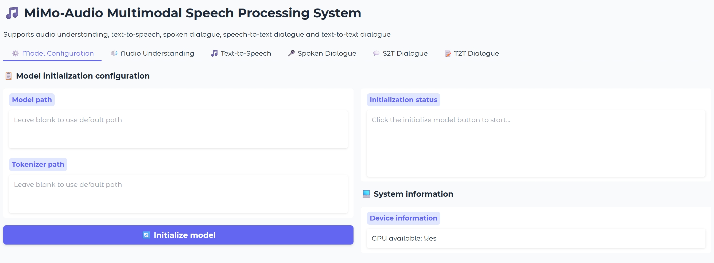

<div align="center">
  <picture>
    <source srcset="https://github.com/XiaomiMiMo/MiMo-VL/raw/main/figures/Xiaomi_MiMo_darkmode.png?raw=true" media="(prefers-color-scheme: dark)">
    
  </picture>
</div>

<h3 align="center">
  <b>
    <span>━━━━━━━━━━━━━━━━━━━━━━━━━━━━━━━━━━━━━━━━━</span>
    <br/>
    MiMo Audio: Audio Language Models are Few-Shot Learners
    <br/>
    <span>━━━━━━━━━━━━━━━━━━━━━━━━━━━━━━━━━━━━━━━━━</span>
    <br/>
  </b>
</h3>

<br/>

<div align="center" style="line-height: 1;">
  |
  <a href="https://huggingface.co/collections/XiaomiMiMo/mimo-audio-68cc7202692c27dae881cce0" target="_blank">🤗 HuggingFace</a>
  &nbsp;|
  <a href="https://github.com/XiaomiMiMo/MiMo-Audio/blob/main/MiMo-Audio-Technical-Report.pdf" target="_blank">📄 Paper</a>
  &nbsp;|
  <a href="https://xiaomimimo.github.io/MiMo-Audio-Demo" target="_blank">📰 Blog</a>
  &nbsp;|
  <a href="https://huggingface.co/spaces/XiaomiMiMo/mimo_audio_chat" target="_blank">🔥 Online Demo</a>
  &nbsp;|
  <a href="https://github.com/XiaomiMiMo/MiMo-Audio-Eval" target="_blank">📊 MiMo-Audio-Eval</a>
  &nbsp;|

  <br/>
</div>

<br/>

## Introduction

Existing audio language models typically rely on task-specific fine-tuning to accomplish particular audio tasks. In contrast, humans are able to generalize to new audio tasks with only a few examples or simple instructions. GPT-3 has shown that scaling next-token prediction pretraining enables strong generalization capabilities in text, and we believe this paradigm is equally applicable to the audio domain. By scaling MiMo-Audio's pretraining data to over one hundred million of hours, we observe the emergence of few-shot learning capabilities across a diverse set of audio tasks. We develop a systematic evaluation of these capabilities and find that MiMo-Audio-7B-Base achieves SOTA performance on both speech intelligence and audio understanding benchmarks among open-source models. Beyond standard metrics, MiMo-Audio-7B-Base generalizes to tasks absent from its training data, such as voice conversion, style transfer, and speech editing. MiMo-Audio-7B-Base also demonstrates powerful speech continuation capabilities, capable of generating highly realistic talk shows, recitations, livestreaming and debates. At the post-training stage, we curate a diverse instruction-tuning corpus and introduce thinking mechanisms into both audio understanding and generation. MiMo-Audio-7B-Instruct achieves open-source SOTA on audio understanding benchmarks, spoken dialogue benchmarks and instruct-TTS evaluations, approaching or surpassing closed-source models.





## Architecture
### MiMo-Audio-Tokenizer
MiMo-Audio-Tokenizer is a 1.2B-parameter Transformer operating at 25 Hz. It employs an eight-layer RVQ stack to generate 200 tokens per second. By jointly optimizing semantic and reconstruction objectives, we train MiMo-Audio-Tokenizer from scratch on a 10-million-hour corpus, achieving superior reconstruction quality and facilitating downstream language modeling.



MiMo-Audio couples a patch encoder, an LLM, and a patch decoder to improve modeling efficiency for high-rate sequences and bridge the length mismatch between speech and text. The patch encoder aggregates four consecutive time steps of RVQ tokens into a single patch, downsampling the sequence to a 6.25 Hz representation for the LLM. The patch decoder autoregressively generates the full 25 Hz RVQ token sequence via a delayed-generation scheme.
### MiMo-Audio


##  Explore MiMo-Audio Now! 🚀🚀🚀
- 🎧 **Try the Hugging Face demo:** [MiMo-Audio Demo](https://huggingface.co/spaces/XiaomiMiMo/mimo_audio_chat)
- 📰 **Read the Official Blog:** [MiMo-Audio Blog](https://xiaomimimo.github.io/MiMo-Audio-Demo)
- 📄 **Dive into the Technical Report:** [MiMo-Audio Technical Report](https://github.com/XiaomiMiMo/MiMo-Audio/blob/main/MiMo-Audio-Technical-Report.pdf)


## Model Download
| Models   | 🤗 Hugging Face |
|-------|-------|
| MiMo-Audio-Tokenizer | [XiaomiMiMo/MiMo-Audio-Tokenizer](https://huggingface.co/XiaomiMiMo/MiMo-Audio-Tokenizer) |
| MiMo-Audio-7B-Base | [XiaomiMiMo/MiMo-Audio-7B-Base](https://huggingface.co/XiaomiMiMo/MiMo-Audio-7B-Base) |
| MiMo-Audio-7B-Instruct | [XiaomiMiMo/MiMo-Audio-7B-Instruct](https://huggingface.co/XiaomiMiMo/MiMo-Audio-7B-Instruct) |


```bash
pip install huggingface-hub

hf download XiaomiMiMo/MiMo-Audio-Tokenizer --local-dir ./models/MiMo-Audio-Tokenizer
hf download XiaomiMiMo/MiMo-Audio-7B-Base --local-dir ./models/MiMo-Audio-7B-Base
hf download XiaomiMiMo/MiMo-Audio-7B-Instruct --local-dir ./models/MiMo-Audio-7B-Instruct
```

## Getting Started

Spin up the MiMo-Audio demo in minutes with the built-in Gradio app.

### Prerequisites (Linux)

* Python 3.12
* CUDA >= 12.0

### Installation

```bash
git clone https://github.com/XiaomiMiMo/MiMo-Audio.git
cd MiMo-Audio
pip install -r requirements.txt
pip install flash-attn==2.7.4.post1
```

> \[!Note]
> If the compilation of flash-attn takes too long, you can download the precompiled wheel and install it manually:
>
> * [Download Precompiled Wheel](https://github.com/Dao-AILab/flash-attention/releases/download/v2.7.4.post1/flash_attn-2.7.4.post1+cu12torch2.6cxx11abiFALSE-cp312-cp312-linux_x86_64.whl)
>
> ```sh
> pip install /path/to/flash_attn-2.7.4.post1+cu12torch2.6cxx11abiFALSE-cp312-cp312-linux_x86_64.whl
> ```

### Run the demo

```bash
python run_mimo_audio.py
```

This launches a local Gradio interface where you can try MiMo-Audio interactively.



Enter the local paths for `MiMo-Audio-Tokenizer` and `MiMo-Audio-7B-Instruct`, then enjoy the full functionality of MiMo-Audio!

## Inference Scripts

### Base Model
We provide an example script to explore the **in-context learning** capabilities of `MiMo-Audio-7B-Base`.  
See: [`inference_example_pretrain.py`](inference_example_pretrain.py)

### Instruct Model
To try the instruction-tuned model `MiMo-Audio-7B-Instruct`, use the corresponding inference script.  
See: [`inference_example_sft.py`](inference_example_sft.py)


## Evaluation Toolkit
Full evaluation suite are available at 🌐[MiMo-Audio-Eval](https://github.com/XiaomiMiMo/MiMo-Audio-Eval).


This toolkit is designed to evaluate MiMo-Audio and other recent audio LLMs as mentioned in the paper. It provides a flexible and extensible framework, supporting a wide range of datasets, tasks, and models.

## Citation

```bibtex
@misc{coreteam2025mimoaudio,
      title={MiMo-Audio: Audio Language Models are Few-Shot Learners}, 
      author={LLM-Core-Team Xiaomi},
      year={2025},
      url={https://github.com/XiaomiMiMo/MiMo-Audio}, 
}
```


## Contact

Please contact us at [mimo@xiaomi.com](mailto:mimo@xiaomi.com) or open an issue if you have any questions.
